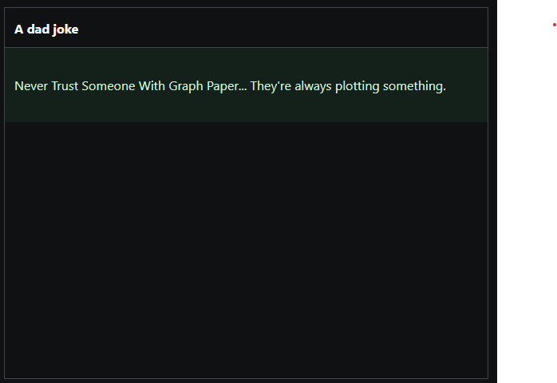

# sanity-plugin-dashboard-dad-jokes

> This is a **Sanity Studio v3** plugin.

## Why???

Who doesn't like jokes. A dad joke is lame enough to make you laugh and cry at the same time.



## What is happening in the background?

This widget takes dad jokes from [https://icanhazdadjoke.com/](https://icanhazdadjoke.com/)

## Installation

```sh
npm install --save sanity-plugin-dashboard-dad-jokes
```

Ensure that you have followed install and usage instructions for @sanity/dashboard

## Usage

Add it as a widget in `sanity.config.ts` (or .js):

```ts
import {defineConfig} from 'sanity'
import { dashboardTool } from "@sanity/dashboard";
import { jokesWidget } from "sanity-plugin-dashboard-dad-jokes";

export default defineConfig({
  //...
  dashboardTool({
    widgets: [
        jokesWidget(),
    ],
  }),
})
```

## Size Config

The widget size can be controlled using layout.width:

```ts
dashboardTool({
  widgets: [jokesWidget({layout: {width: 'small'}})],
})
```

## Inspiration

I took inspiration from the [Cats Widget](https://github.com/sanity-io/example-dashboard-widget-cats) official plugin of Sanity.

## License

[MIT](LICENSE) © Sachin Sancheti

## Develop & test

This plugin uses [@sanity/plugin-kit](https://github.com/sanity-io/plugin-kit)
with default configuration for build & watch scripts.

See [Testing a plugin in Sanity Studio](https://github.com/sanity-io/plugin-kit#testing-a-plugin-in-sanity-studio)
on how to run this plugin with hotreload in the studio.